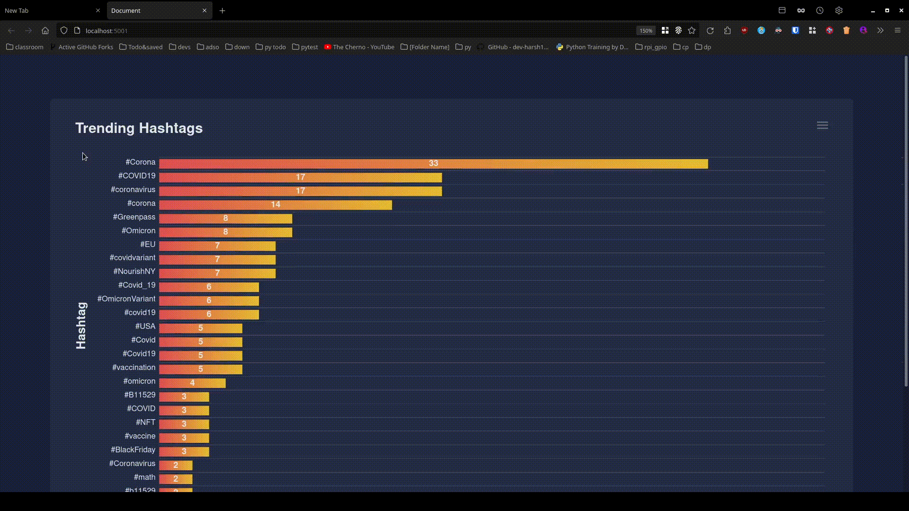

# <b><center>Spark tweet analysis<br></b></center>

This is Our Project for the Cloud Computing Course. 
This project will fetch recent tweets based on “keywords” and “pages”, 
using Twitter API v2, filter hashtags from those tweets and give those hashtags 
to spark streaming for processing. After that it will launch a flask web server 
on localhost:5001 to view the data in a visual dashboard powered by ApexCharts.

### Introduction

We are Using Apache Spark streaming, Real-Time Analytics engine, 
to process tweets retrieved from Twitter API and identify the trending hashtags 
from them based on a certain keywords and, finally, 
represent the data in a real-time dashboard using flask web framework.

### Limitations

- 450 queries per 15 minutes (enforced by twitter APIv2)
  . [see here](https://developer.twitter.com/en/docs/twitter-api/tweets/search/api-reference/get-tweets-search-recent)
- 500K queries per month(enforced by twitter APIv2)
  . [see here](https://developer.twitter.com/en/docs/twitter-api/rate-limits)
- We cannot get general tweets from Twitter. We have to get tweets based on some keywords (enforced by twitter APIv2)

### Getting API keys from twitter.

The dataset used for this project is Twitter tweets. So, to get the Twitter tweets, we need access to Twitter API.

- Go to the [developer portal dashboard](https://developer.twitter.com/en/portal/dashboard)
- Sign in with your developer account
- Create a new project, give it a name, a use-case based on the goal you want to achieve, and a description.
- choose ‘create a new App instead’ and give your App a name in order to create a new App
- If everything is successful, you should be able to see page containing your keys and tokens, we will use Bearer token
  to access the API.
- Make a new file ```keys.txt``` and in it put the bearer token in below format.<br>
  ```token:<your_token_here>```<br>
  Make sure there are no spaces between ```token``` & ```:``` and ```:``` & ```<your_token>```

### Working of the project:


- First, We retrieve tweets from Twitter using
  the [Twitter APIv2](https://developer.twitter.com/en/docs/twitter-api/getting-started/make-your-first-request).
- The tweets are based on keywords that user specifies. (see running the app section)
- The data is processed with the pyspark and hashtags are separated from tweets.
- Then we send tweets through a TCP Socket to spark.
- Using Apache spark, we process those trending hashtags.
- To display the data in a visual representation, we are using flask web app.

### Running the Application

First steps...

- Java version should be compatible with pyspark. Current version of pyspark is 3.2.0 and only java version 11 is
  compatible. You can check java version by running command ```java --version```. Make sure to have only compatible java
  version installed.
- ```git clone https://github.com/HritwikSinghal/Spark-tweet.git```
- ```cd Spark-tweet```
- ```pip install -r ./requirements.txt```

Now...

#### 1. Automatic run

Simply run ```run.sh```. if you want the defaults. The defaults are :

- keywords = "corona bitcoin gaming Android climate cricket"
- pages = 15 (per keyword)

Note that this will open the browser window and will kill the app after 4 minutes.
(this will not happen if you use manual run, although you can modify ```run.sh``` to change this behaviour)

#### 2. Manual run

Run the Programs in the order. **NOTE: Every step should be run in new terminal** <br>

1. Flask Application ```python3 ./app.py```


2.

 ```
   export PYSPARK_PYTHON=python3
   export SPARK_LOCAL_HOSTNAME=localhost
   python3 ./spark_app.py
 ```

3. ```python3 ./twitter_app.py -p _<no_of_pages>_ -k _<"keywords">_```

Replace ```_<"keywords">_``` with the keywords you want to search
(Note that keywords should be in quotes, like ```"corona bitcoin gaming Android"```)

and ```<no_of_pages>``` with the number of pages you want for each keyword from twitter.

### Visual representation

You can access the real-time data in visual representation by accessing this URL given below.

```
http://localhost:5001/ 
```

or

```
http://127.0.0.1/5001
```

### Stopping the application

run ```killall python3```  in new terminal

### Final Output



